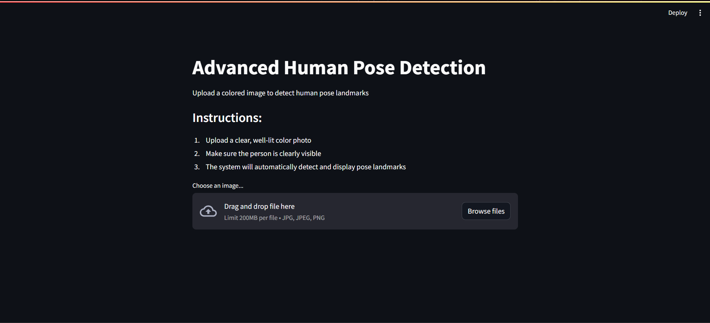
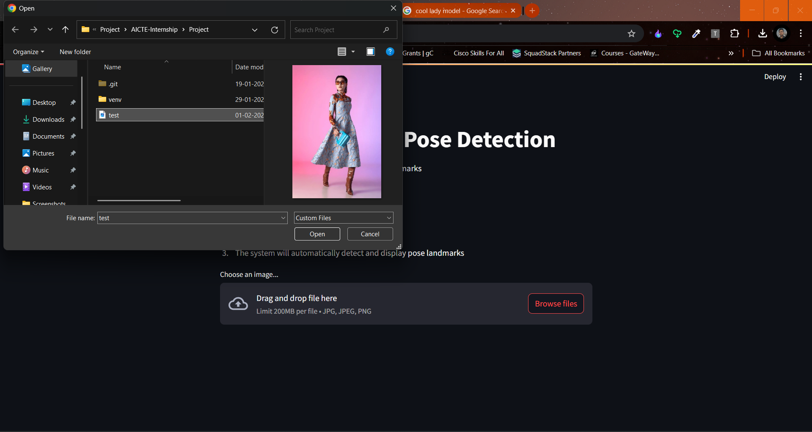
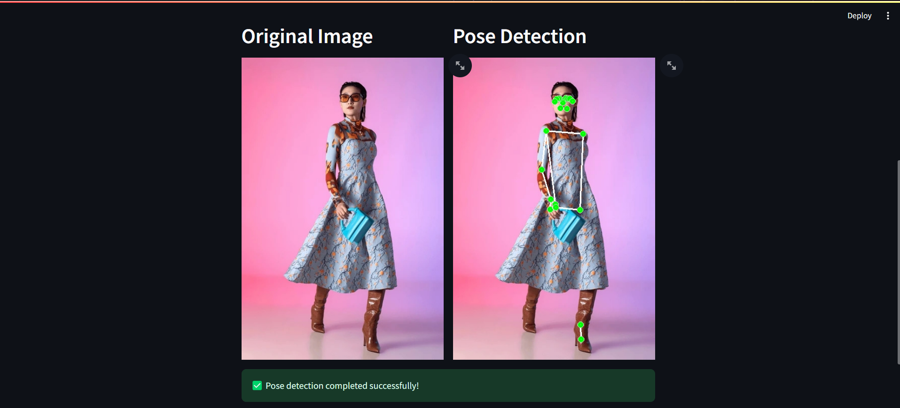

# Human-Pose-Detection
======= =======
# 🎯 Advanced Human Pose Detection

A powerful web application that detects and visualizes human pose landmarks in real-time using MediaPipe and Streamlit.


## ✨ Features

- 🎨 Upload colored images
- 🔍 Real-time pose detection
- 🎯 High-precision landmark detection
- 📊 Side-by-side visualization
- 🖼️ Preserves original image quality
- 🚀 Fast processing
- 📱 Responsive design

## 🛠️ Technologies Used

- Python 3.x
- Streamlit
- MediaPipe
- OpenCV
- NumPy
- Pillow

## 🚀 Installation

1. Clone the repository:
```bash
git clone https://github.com/yourusername/human-pose-detection.git
cd human-pose-detection
```

2. Install dependencies:
```bash
pip install -r requirements.txt
```

3. Run the application:
```bash
streamlit run app.py
```


## 📸 Screenshots





## 📝 Usage

1. 📤 Upload a clear, well-lit color photo
2. 👀 Make sure the person is clearly visible in the image
3. 🎯 The system will automatically detect and display pose landmarks
4. 📊 View the original image and pose detection side by side

## ⚙️ Requirements

Check `requirements.txt` for detailed dependencies:
-mediapipe
-streamlit==1.29.0
-numpy==1.26.2
-opencv-python==4.8.1.78
-Pillow==10.1.0
-blinker

## 🤝 Contributing

Contributions, issues, and feature requests are welcome! Feel free to check the [issues page](https://github.com/yourusername/human-pose-detection/issues).

## 📄 License

This project is licensed under the MIT License - see the [LICENSE](LICENSE) file for details.

## 👏 Acknowledgments

- MediaPipe team for their excellent pose detection model
- Streamlit team for the amazing web framework
- All contributors and users of this project
>>>>>>> a90f82fc (Last Commit)
>>>>>>> 1e3a3600 (Last Commit1)
